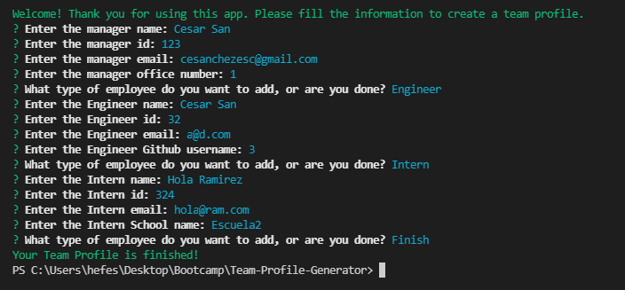
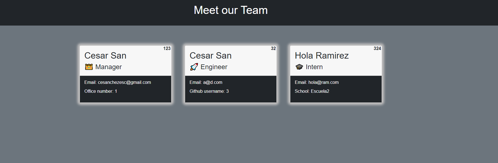

# Team Profile Generator 

  ## Description
  
  
Team Profile Generator is a Node.js app to create a webpage that displays a team basic information incluing email and github profile. This app uses the Inquirer package to get the team information. It also uses the Jest package for testing units. It was done using Test Driven Development. The HTML were tested first for styling in independent files then the code was added to the corresponding functions.

  
  ## Table of Contents
  
  - [Installation](#installation)
  - [Usage](#usage)
  - [License](#license)
  - [Contributing](#license)
  - [Tests](#license)
  - [Questions](#license)
  
  ## Installation
  
  
- Download. - Install packages. - Run node index.js in the terminal.

  
  ## Usage
  
  
Run node index.js in the terminal, then fill the information required. 

  
  

  
  ## License
  
  
Copyright (c) 2022, Cesar San All rights reserved.
Licensed under the MIT license. 

  
  
[License](./MIT_license.txt)

  
  ## How to Contribute
  
  
More employee classes could be addded. Also a more compĺete employee structure could show hierarchy and functions.

  
  ## Tests
  
  
Open the link to watch the video of the test
[Video](https://github.com/csancheze/Team-Profile-Generator/blob/main/assets/test.mkv)

or in Google Drive
[Video in Drive](https://drive.google.com/file/d/12w7ku90W-mOFZxuAQ3jc4DgEagYShfhG/view?usp=sharing)

  
  ## Questions
  
  If you have any question feel free to check my Github 
  
Username:csancheze
  
[Github](https://github.com/csancheze)

  or send me and email
  
<cesanchezesc@gmail.com>

